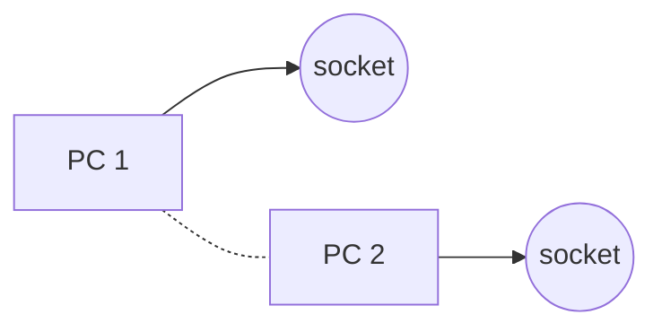
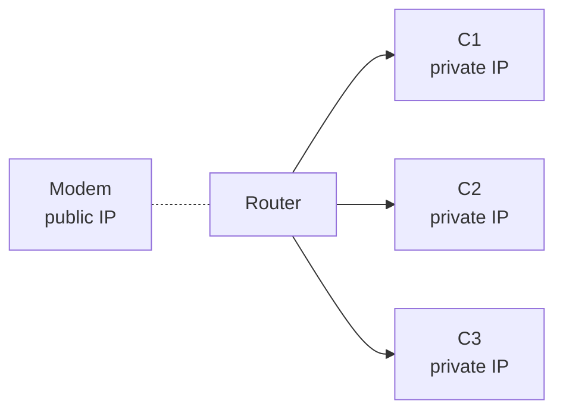
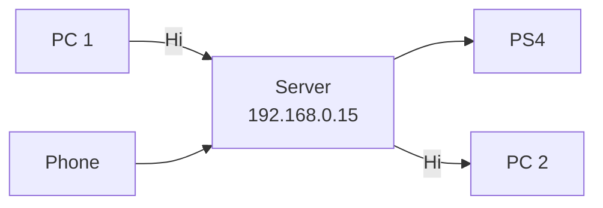

# Sockets
A socket is an endpoint of a two-way communication link between two programs that you can name and address in a network.

## Local Network

## Client-Server Architecture

## TCP vs UDP
|       TCP                       |      HTML                 |                    
|---------------------------------|---------------------------|
| Reliable -> detects packet loss | Sends one Datagram        |
| Connection-based                | No order                  |
| Sequential                      | No Guarantee              |
| Byte Stream                     | Real-Time, Faster         |
| Keeps up connection             | Less Network and PC stress|

Ex. Skype uses UDP for calls and TCP for chats/messages. 